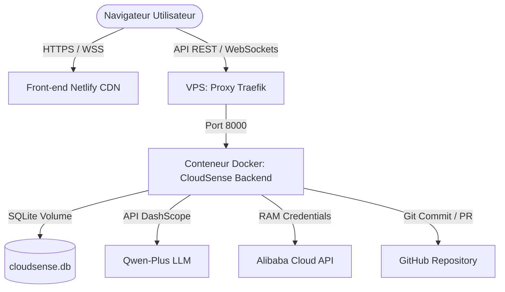

# 🚀 Guide de Déploiement Production — CloudSense

Ce guide détaille la procédure pas-à-pas pour déployer **CloudSense** en architecture découplée :
1. **Backend (API + WebSocket + Tâches Autonomes)** : Déployé sur votre **VPS AWS EC2** via SSH et Docker Compose avec le script automatisé.
2. **Frontend (Dashboard React)** : Déployé sur **Netlify** pour une performance CDN optimale et une disponibilité maximale.

---

## 📐 Architecture de Production



---

## 🛠️ Partie 1 : Déploiement du Backend sur le VPS AWS (via `deploy.sh`)

Nous avons adapté votre script de déploiement préféré à la racine du projet sous le nom [deploy.sh](file:///Users/mac/Desktop/Workspace/cloudsense/deploy.sh). Ce script automatise la synchronisation Git locale, pousse vos modifications et se connecte par SSH à votre serveur pour lancer les conteneurs avec Docker Compose.

### 1. Prérequis local
- Avoir votre clé SSH privée placée à l'emplacement défini : `/Users/mac/Desktop/deploy/dev-ssh-key.pem`.
- Avoir configuré les accès distants corrects si nécessaire dans le script (par défaut : `ec2-13-39-19-215.eu-west-3.compute.amazonaws.com` avec l'utilisateur `ubuntu`).

### 2. Lancer le déploiement
Exécutez simplement la commande suivante depuis votre terminal local :
```bash
./deploy.sh
```

### 3. Fonctionnement du script
1. **Validation Git** : Vérifie que vous êtes sur la branche `main` (ou demande confirmation si branche différente).
2. **Sync & Push** : Ajoute, commite localement avec un message horodaté et pousse les modifications sur votre dépôt GitHub.
3. **SSH Connect** : Se connecte de manière sécurisée à votre serveur EC2.
4. **Git Pull Distant** : Clone le projet sur le serveur (dans `/var/www/html/apps/cloudsense`) ou effectue un `git pull` des dernières modifications.
5. **Config .env** : Copie le fichier `.env.example` en `.env` sur le serveur s'il est manquant pour que vous puissiez y renseigner vos variables secrètes (`QWEN_API_KEY`, `ALIBABA_ACCESS_KEY_ID`, etc.).
6. **Docker Compose** : Lance la commande `docker compose up -d --build` pour compiler l'image et démarrer le backend au sein de votre écosystème Docker/Traefik.

---

## ⚡ Partie 2 : Déploiement du Frontend sur Netlify

Grâce au fichier [netlify.toml](file:///Users/mac/Desktop/Workspace/cloudsense/netlify.toml) présent à la racine, le déploiement sur Netlify est entièrement automatique.

### 1. Connecter le dépôt Git à Netlify
1. Allez sur votre tableau de bord **Netlify** > **Add new site** > **Import an existing project**.
2. Sélectionnez votre dépôt GitHub `cloudsense`.
3. Netlify lira automatiquement le fichier `netlify.toml` et pré-remplira les commandes de build et dossiers de publication.

### 2. Configurer la variable d'environnement (CRITIQUE)
Indiquez au frontend l'emplacement de votre API déployée :
1. Allez dans les paramètres de votre site sur Netlify : **Site configuration** > **Environment variables**.
2. Ajoutez la variable :
   - **Clé** : `VITE_API_URL`
   - **Valeur** : *L'adresse de votre backend sur votre VPS AWS (ex: `https://api.cloudsense.votredomaine.com` ou l'adresse IP associée à votre entrée Traefik)*

### 3. Déployer
Cliquez sur **Deploy site**. Netlify compile l'application et la déploie sur son CDN mondial.

---

## 🔍 Partie 3 : Vérification et Validation

Ouvrez l'application Netlify dans votre navigateur :
1. **Vérification API & WebSocket** :
   - Ouvrez la console F12. Vous verrez la connexion WebSocket s'établir : `Connecting to WebSocket: wss://<votre-api>/ws`.
   - La bannière verte supérieure du Dashboard affichera **"Live Account Connected"** en us-east-1.
2. **Vérification de la persistance** :
   - Les données modifiées dans l'onglet **Threshold Settings** sont persistées de manière permanente dans le volume SQLite du conteneur.
