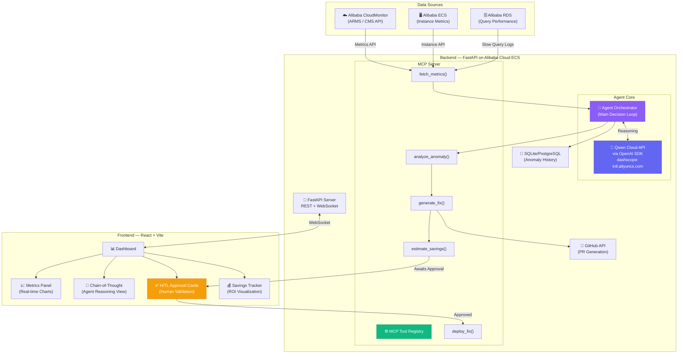
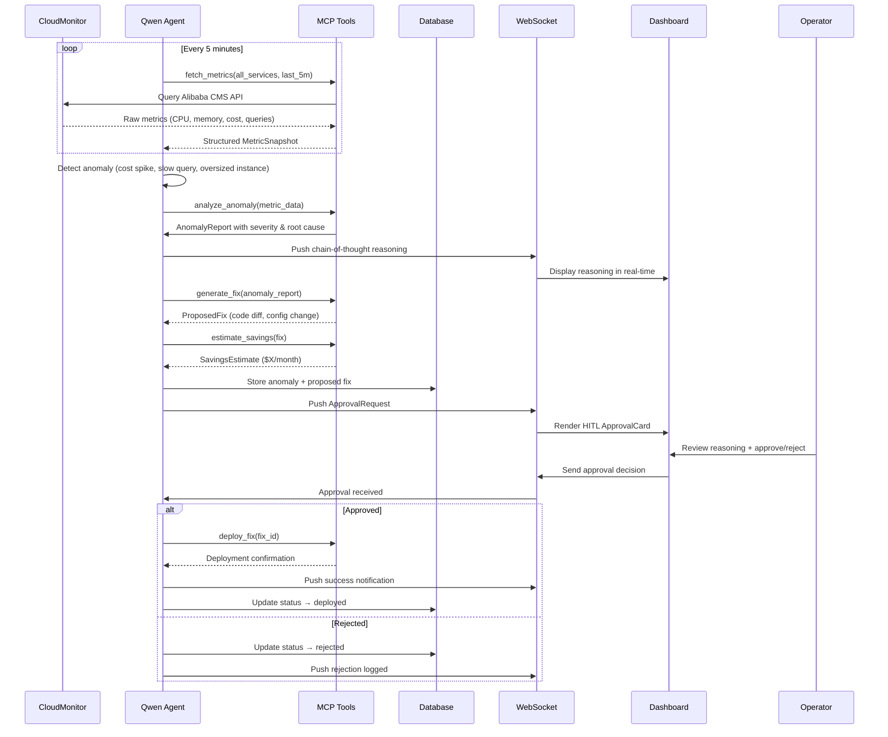

# CloudSense Architecture

## System Overview

CloudSense is an autonomous Alibaba Cloud cost optimization agent built on Qwen Cloud (Track 4: Autopilot Agent). It continuously monitors infrastructure metrics, detects cost anomalies using Qwen's reasoning capabilities, generates fixes, and requires human approval before deploying changes.

## Architecture Diagram

## Data Flow

## Key Technical Decisions

| Decision | Choice | Rationale |
|----------|--------|-----------|
| LLM Integration | OpenAI SDK → Qwen Cloud | API-compatible, zero custom wrappers needed |
| Agent Framework | Custom orchestrator | Full control over tool calling loop, MCP native |
| Real-time Comms | WebSocket | Live chain-of-thought streaming to dashboard |
| MCP Protocol | Custom MCP server | Required by judging criteria (MCP integrations) |
| Database | SQLite (demo) / PostgreSQL (prod) | Lightweight for hackathon, swappable |
| Frontend | React + Vite | Fast dev cycle, modern tooling |
| Deployment | Docker on Alibaba ECS | Matches hackathon requirement |

## MCP Tools Specification

| Tool | Input | Output | Side Effects |
|------|-------|--------|-------------|
| `fetch_metrics` | service: str, time_range: str | MetricSnapshot[] | None (read-only) |
| `analyze_anomaly` | metric_data: MetricSnapshot | AnomalyReport | None (Qwen reasoning) |
| `generate_fix` | anomaly: AnomalyReport | ProposedFix | Creates GitHub PR |
| `estimate_savings` | fix: ProposedFix | SavingsEstimate | None (calculation) |
| `deploy_fix` | fix_id: str | DeployResult | **Deploys change** (HITL gated) |
